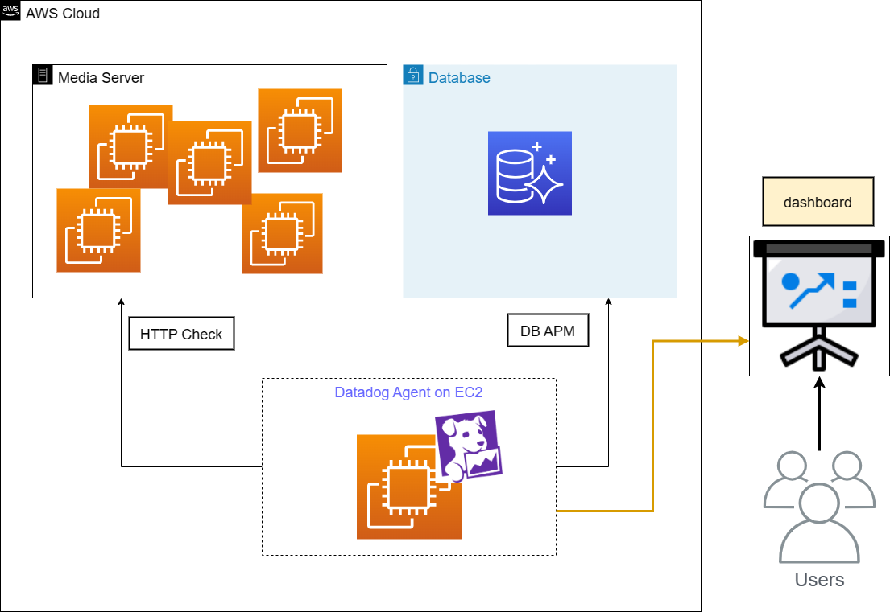

## Introduction

I plan to monitoring system with Datadog at office. At first, I prepared EC2 server for running Datadog Agent to monitor media servers and DB. However, I think that it's a waste of cost to run server just starting Datadog Agent. So I decided to migrate Datadog Agent from EC2 to ECS.



## About App Runner

https://aws.amazon.com/apprunner/

> AWS App Runner is a fully managed container application service that lets you build, deploy, and run containerized web applications and API services without prior infrastructure or container experience.

I found it convenient that it is not need to set complex network configure and is able to implement fully managed container CI/CD deployment. But, I found something odd when I monitored the media server externally with Agent on App Runner.

## Increase Response time

This is the graph of response time Datadog Agent obtained from our servers.


Response time increased rapidly immediately after migrating to App Runner. After a day had passed and it was not back to normal, I moved it to ECS on Fargate.

## Curl inspection

I prepared curl container[^1] which obtains response time and measured ECS on Fargate and App Runner to compare the performance of each container

```dockerfile
FROM  curlimages/curl:latest

CMD  curl -s -o /dev/null -w '%{time_starttransfer}' <URL>
```

[^1]: https://hub.docker.com/r/curlimages/curl

#### e.g.

```console
$ docker build -t curl-yuta .
$ docker run --rm curl-yuta
0.252717
```

There are two screenshots that Agent from ECS on Fargate or App Runner obtains response time.

### ECS on Fargate


### App Runner


It found that the response time is slower when retrieved via App Runner, even in curl.

## Mystery Container

Datadog automatically registers containers with agents in their dashboards.

### ECS on Fargate


### App Runner


On Fargate, when Datadog Agent was installed into the container, one unit was registered. However, on App Runner, two units was registered.

Mystery container, `aws-fargate-request-proxy` was running, but I could not find details about this container in the App Runner documentation.

In my guess, deployed container on App Runner doesn't connect directly external and it takes a long time since the proxy container exists between App Runner container and Internet.


