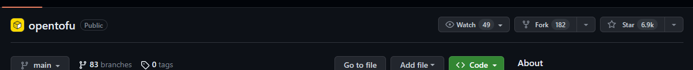

_I write articles in English with the help of DeepL_

## Table of Contents

<ul>
  <li><a href="#introduction">Introduction</a></li>
  <li><a href="#target-audience">Target Audience</a></li>
  <li><a href="#about-open-source">About Open Source</a></li>
  <li><a href="#impact-of-hashicorps-license-change">Impact of HashiCorp's license change</a></li>
  <li><a href="#the-foundations-claims">The Foundation's claims</a>
    <ul>
      <li><a href="#about-monetization-of-terraform">About monetization of Terraform</a></li>
    </ul>
  </li>
  <li><a href="#forked-opentofu">Forked OpenTofu</a></li>
  <li><a href="#hands-on">Hands-on</a>
    <ul>
      <li><a href="#is-it-possible-to-migrate-existing-resources">Is it possible to migrate existing resources</a></li>
    </ul>
  </li>
  <li><a href="#conclusion">Conclusion</a></li>
  <li><a href="#original">Original</a></li>
  <li><a href="#references">References</a></li>
</ul>

## Introduction

In August 2023, HashiCorp, a developer of OSS such as Terraform, switched Terraform from an open source license to the Business Source License (BSL).

 HashiCorp adopts Business Source License 

This license change will not directly affect HashiCorp users of Terraform and other products. However, there is a movement against HashiCorp's license change, and a group has formed to pursue true open source, forked from Terraform. It is [OpenTF Foundation](https://https://opentofu.org/).

According to the manifesto, the OpenTF Foundation had demanded that HashiCorp switches Terraform back to an open-source license in order for Terraform to remain truly open source, and stated that it would maintain OpenTF forked from Terraform, if HashiCorp would not.

And so, on September 6, 2023 OpenTF was forked. Moreover, OpenTF has been renamed OpenTofu and the OpenTF Foundation joined the Linux Foundation.



What kind of OSS is OpenTofu? And why did they decide to fork from Terraform? Let's take a look at their manifesto.

## Target Audience

- People who want to know about OpenTofu
- People who want to know about the Foundation's claims

## About Open Source

The term "truly open source" appears several times in the above manifesto.  
I wasn't sure what "truly open source" meant, so I checked the definition of open source. The Open Source Initiative (OSI)[^1] has the [following definition of open source](https://opensource.org/definition-annotated/).

1. Free Redistribution
2. Source Code
3. Derived Works
4. Integrity of The Author’s Source Code
5. No Discrimination Against Persons or Groups
6. No Discrimination Against Fields of Endeavor
7. Distribution of License
8. License Must Not Be Specific to a Product
9. License Must Not Restrict Other Software

[^1]: https://opensource.org/

## Impact of HashiCorp's license change

HashiCorp's newly adopted license, the Business Source License(BSL)[^2], allows the release of the source code, but restricts commercial use. Because it a restricted use license, the owner clearly states that the BSL is not an open source license.

> Q: Is the BSL an Open Source license?[^3]  
> A: The BSL does not meet the Open Source Definition (OSD) maintained by the Open Source Initiative (OSI). OSD does not allow limitations on specific kinds of such, such as production use. However, most of the OSD criteria are met. Most important, the source code is made available. The BSL allows for copying, modification, creation of derivative works, redistribution, and non-production use of the code. It allows for (and encourages) the licensor to define an Additional Use Grant (e.g., allowing for free use below a specified level, like in this example).

However, HashiCorp clearly states that it allows the commercial use, except for use such as incorporating Terraform into a competing company's product.

> All non-production uses are permitted. All production uses are allowed other than hosting or embedding the software in an offering competitive with HashiCorp commercial products, hosted or self-managed.[^4]

What does the term “embedded” mean under the HashiCorp BSL license? HashiCorp answered this question.

> Under the HashiCorp BSL license, the term “embedded” means including the source code or object code, including executable binaries, from a HashiCorp product in a competitive product. “Embedded” also means packaging the competitive product in such a way that the HashiCorp product must be accessed or downloaded for the competitive product to operate.

Don't get me wrong, even if we are building a competing product for HashiCorp, there is nothing wrong with using their Vault for the purpose of securing a product that competes with Terraform, or deploying in Terraform to build a product that competes with the Vault.[^5]

[^2]: https://mariadb.com/bsl11/
[^3]: https://mariadb.com/bsl-faq-adopting/#osl
[^4]: https://www.hashicorp.com/license-faq#who-is-impacted
[^5]: https://www.hashicorp.com/license-faq#competitive-product-bsl-coverage

## The Foundation's claims

According to the manifesto, the Foundation strongly criticizes that the BSL is a poison pill for Terraform.

Even if the license change does not affect end users or integration partners currently using Terraform, they claim that HashiCorp could change the license terms or its interpretation of them in the future so that they would not be able to freely use it.

The Foundation is concerned that Terraform's influence will diminish and the community will wane as developers and enterprises leave Terraform out of their choices when selecting a tool to manage their infrastructure.

So, to return to the claim at the beginning, the Foundation had demanded that HashiCorp rescinds the license change, and if they would not do so, they would maintain OpenTF forked from Terraform.

At the end of the manifesto is a Q&A summary. Here is the question I found interesting.

> Didn't HashiCorp adopt BUSL to deter vendors who were using Terraform but not contributing back?

HashiCorp's license change was prompted by some vendors free-riding on OSS. HashiCorp also states in [its blog](https://www.hashicorp.com/blog/hashicorp-adopts-business-source-license) that using OSS only for one's own commercial purposes without contributing to the open source community is against the spirit of open source.

On the other hand, the Foundation refutes HashiCorp's claims as follows.

> This is inaccurate and misleading. First of all, many of the vendors affected by the change to BUSL have made considerable contributions to the Terraform community.

For example, contributions have included Terraform binaries or modules, learning contents, and third-party tools such as Terragrunt[^6] and tflint[^7].

Terraform are part of a large ecosystem. The same is true of Kubernetes or Linux or Go or other major infrastructure tools. They stated that Terraform has developed because it is open source and it would be a bad thing not to acknowledge the work of vendors.

Also, they claim that HashiCorp might not support Terraform OSS issues and PR because they will not be able to direct monetization to Terraform Cloud and Terraform Enterprise.

[^6]: https://terragrunt.gruntwork.io/
[^7]: https://github.com/terraform-linters/tflint

### About monetization of Terraform

As a side note, "Could HashiCorp's license change be due to poor monetization of Terraform?" A certain [article](https://www.theregister.com/2023/08/28/opentf_forks_terraform_code/) claim that this is the reason HashiCorp has changed its license.

Asked why HashiCorp opted for a change of license, Stadil, CEO of Scalr[^8] claimed in the article.

> The reality here is that HashiCorp is not executing well on its Terraform cloud product. And because they're not executing well, other competitors like my company Scalr and a number of others have stepped in.

To be honest, I think Terraform Cloud has become a little more difficult to because of the change in billing plans. The former plan allowed up to 5 users per organization to use Terraform Cloud for free, but the new plan allows up to 500 resources for free. 500 resources will soon exceed the free limit, so I think many users would have switched to the paid plan.

[^8]: https://www.scalr.com/

## Forked OpenTofu

OpenTofu forked on September 6, 2023 already has over 6,000 stars.



Git clone and run `opentf` on own local machine.

```terminal
$ git clone git@github.com:opentffoundation/opentf.git
$ cd opentf

$ make
$ go install

$ opentf version
OpenTF v1.6.0-dev
on linux_amd64
```

## Hands-on

As a tutorial, play [hands-on](https://developer.hashicorp.com/terraform/tutorials/docker-get-started) to deploy Docker containers of nginx from OpenTF.

```hcl
terraform {
  required_providers {
    docker = {
      source = "kreuzwerker/docker"
      version = "~> 3.0.1"
    }
  }
}

provider "docker" {}

resource "docker_image" "nginx" {
  name         = "nginx:latest"
  keep_locally = false
}

resource "docker_container" "nginx" {
  image = docker_image.nginx.image_id
  name  = "tutorial"
  ports {
    internal = 80
    external = 8000
  }
}
```

Run `opentf init` command on the directory where `main.tf` file is placed just as with Terraform and create the project.

```terminal
$ opentf init
~~~~~~~~~~~~~~~~~~~~~~~
OpenTF has been successfully initialized!

You may now begin working with OpenTF. Try running "opentf plan" to see
any changes that are required for your infrastructure. All OpenTF commands
should now work.
~~~~~~~~~~~~~~~~~~~~~~~
```

After running `opentf apply` command and launching Docker containers and nginx was displayed in the browser.

```terminal
$ opentf apply

OpenTF used the selected providers to generate the following execution plan. Resource actions are indicated with the following symbols:
  + create

OpenTF will perform the following actions:

  # docker_container.nginx will be created
  + resource "docker_container" "nginx" {
      + attach                                      = false
      + bridge                                      = (known after apply)
      + command                                     = (known after apply)
      + container_logs                              = (known after apply)
      + container_read_refresh_timeout_milliseconds = 15000
      + entrypoint                                  = (known after apply)
      + env                                         = (known after apply)
      + exit_code                                   = (known after apply)
      + hostname                                    = (known after apply)
      + id                                          = (known after apply)
      + image                                       = (known after apply)
      + init                                        = (known after apply)
      + ipc_mode                                    = (known after apply)
      + log_driver                                  = (known after apply)
      + logs                                        = false
      + must_run                                    = true
      + name                                        = "tutorial"
      + network_data                                = (known after apply)
      + read_only                                   = false
      + remove_volumes                              = true
      + restart                                     = "no"
      + rm                                          = false
      + runtime                                     = (known after apply)
      + security_opts                               = (known after apply)
      + shm_size                                    = (known after apply)
      + start                                       = true
      + stdin_open                                  = false
      + stop_signal                                 = (known after apply)
      + stop_timeout                                = (known after apply)
      + tty                                         = false
      + wait                                        = false
      + wait_timeout                                = 60

      + ports {
          + external = 8000
          + internal = 80
          + ip       = "0.0.0.0"
          + protocol = "tcp"
        }
    }

  # docker_image.nginx will be created
  + resource "docker_image" "nginx" {
      + id           = (known after apply)
      + image_id     = (known after apply)
      + keep_locally = false
      + name         = "nginx:latest"
      + repo_digest  = (known after apply)
    }

Plan: 2 to add, 0 to change, 0 to destroy.

Do you want to perform these actions?
  OpenTF will perform the actions described above.
  Only 'yes' will be accepted to approve.

  Enter a value: yes

docker_image.nginx: Creating...
docker_image.nginx: Still creating... [10s elapsed]
docker_image.nginx: Creation complete after 10s [id=sha256:f5a6b296b8a29b4e3d89ffa99e4a86309874ae400e82b3d3993f84e1e3bb0eb9nginx:latest]
docker_container.nginx: Creating...
docker_container.nginx: Creation complete after 2s [id=7440041e3dfebcd576edc3aacd39ce16601447b87bde79ac97f72d20996f78e6]

Apply complete! Resources: 2 added, 0 changed, 0 destroyed.
```


### Is it possible to migrate existing resources

I have confirmed that I create a new resource with OpenTF. However, if already used Terraform for IaC, I would like to migrate it instead of creating a new one. I have confirmed that I can deploy updates and delete resources using `opentf` commands for resources created in Terraform.

```terminal
#resource created by Terraform
$ terraform state list
module.module-network.aws_db_subnet_group.database[0]
module.module-network.aws_default_network_acl.this[0]
module.module-network.aws_default_route_table.default[0]
module.module-network.aws_default_security_group.this[0]
module.module-network.aws_internet_gateway.this[0]
module.module-network.aws_route.public_internet_gateway[0]
module.module-network.aws_route_table.private[0]
module.module-network.aws_route_table.private[1]
module.module-network.aws_route_table.private[2]
module.module-network.aws_route_table.public[0]
module.module-network.aws_route_table_association.database[0]
module.module-network.aws_route_table_association.database[1]
module.module-network.aws_route_table_association.database[2]
module.module-network.aws_route_table_association.private[0]
module.module-network.aws_route_table_association.private[1]
module.module-network.aws_route_table_association.private[2]
module.module-network.aws_route_table_association.public[0]
module.module-network.aws_route_table_association.public[1]
module.module-network.aws_route_table_association.public[2]
module.module-network.aws_subnet.database[0]
module.module-network.aws_subnet.database[1]
module.module-network.aws_subnet.database[2]
module.module-network.aws_subnet.private[0]
module.module-network.aws_subnet.private[1]
module.module-network.aws_subnet.private[2]
module.module-network.aws_subnet.public[0]
module.module-network.aws_subnet.public[1]
module.module-network.aws_subnet.public[2]
module.module-network.aws_vpc.this[0]

$ opentf state list
module.module-network.aws_db_subnet_group.database[0]
module.module-network.aws_default_network_acl.this[0]
module.module-network.aws_default_route_table.default[0]
module.module-network.aws_default_security_group.this[0]
module.module-network.aws_internet_gateway.this[0]
module.module-network.aws_route.public_internet_gateway[0]
module.module-network.aws_route_table.private[0]
module.module-network.aws_route_table.private[1]
module.module-network.aws_route_table.private[2]
module.module-network.aws_route_table.public[0]
module.module-network.aws_route_table_association.database[0]
module.module-network.aws_route_table_association.database[1]
module.module-network.aws_route_table_association.database[2]
module.module-network.aws_route_table_association.private[0]
module.module-network.aws_route_table_association.private[1]
module.module-network.aws_route_table_association.private[2]
module.module-network.aws_route_table_association.public[0]
module.module-network.aws_route_table_association.public[1]
module.module-network.aws_route_table_association.public[2]
module.module-network.aws_subnet.database[0]
module.module-network.aws_subnet.database[1]
module.module-network.aws_subnet.database[2]
module.module-network.aws_subnet.private[0]
module.module-network.aws_subnet.private[1]
module.module-network.aws_subnet.private[2]
module.module-network.aws_subnet.public[0]
module.module-network.aws_subnet.public[1]
module.module-network.aws_subnet.public[2]
module.module-network.aws_vpc.this[0]

#possible to delete resources by opentf command
$ opentf destroy
~~~~~~~~~~~~~~~~~~~~~~~

Plan: 0 to add, 0 to change, 29 to destroy.

Do you really want to destroy all resources?
  OpenTF will destroy all your managed infrastructure, as shown above.
  There is no undo. Only 'yes' will be accepted to confirm.

  Enter a value: yes
~~~~~~~~~~~~~~~~~~~~~~~
Destroy complete! Resources: 29 destroyed.
```

However, OpenTofu is still under development for an alpha release and support is limited to test and development environments.[^9]

> Currently, OpenTofu supports local testing and development: you can build the code, run the tests, build opentf binaries, and so on. That means you can now start experimenting with OpenTofu and contributing back via Issues, PRs, and RFCs.

If you find any bugs or errors, contribute to the community by filing an issues or PR.

[^9]: https://opentofu.org/blog/the-opentofu-fork-is-now-available/

## Conclusion

I tried OpenTofu, which is a forked of Terraform. I think there are pros and cons to what the Foundation is claiming. I watch how the de facto standard for IaC turns into a tool in the future.

## Original

 my original post 

## References

https://mariadb.com/ja/resources/blog/mariadb-bsl/  
https://ja.wikipedia.org/wiki/%E3%82%AA%E3%83%BC%E3%83%97%E3%83%B3%E3%82%BD%E3%83%BC%E3%82%B9%E3%82%BD%E3%83%95%E3%83%88%E3%82%A6%E3%82%A7%E3%82%A2%E3%81%AE%E6%AD%B4%E5%8F%B2  
https://zenn.dev/koduki/articles/45f65a5318f019
