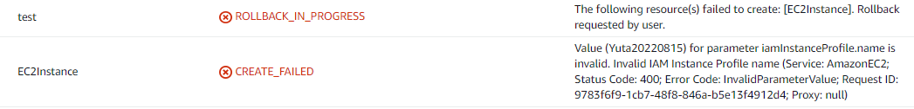

## Introduction

You attach IAM role with IAM policy to AWS resources which granted to operate the other AWS Resources.


However, EC2 is not attached to IAM role, but is attached to IAM Instance Profile.


In AWS CLI, There is the parameter about `IamInstanceProfile`, too.

```console
 aws ec2 describe-instances --query "Reservations[].Instances[].IamInstanceProfile.Arn"
[
    "arn:aws:iam::XXXXXXXXXXXX:instance-profile/Yuta20210911"
]
```

So, what is the IAM Instance Profile?

## About IAM Instance Profile

https://docs.aws.amazon.com/AWSEC2/latest/UserGuide/iam-roles-for-amazon-ec2.html

I found the following description in the AWS documentation.

> Amazon EC2 uses an instance profile as a container for an IAM role. When you create an IAM role using the IAM console, the console creates an instance profile automatically and gives it the same name as the role to which it corresponds. If you use the Amazon EC2 console to launch an instance with an IAM role or to attach an IAM role to an instance, you choose the role based on a list of instance profile names.

Instance profile is the container stored the IAM role and described as attaching that container to EC2 in the document. It is the concept used only in EC2, and when you create IAM role, is created same name automatically. You don't have to be aware of the difference between IAM Instance profile and IAM role. At the important point, it is the case of Infrastructure as Code(IaC)

## Points to note when developing IaC

When you attach IAM roles to Lambda or CodePipeline, write Arn of IAM roles in role parameter by CloudFormation or Terraform.

### To create Lambda by IaC

```yaml
# CloudFormation template file
AWSTemplateFormatVersion: '2010-09-09'
Resources:
  LambdaFunction:
    Type: 'AWS::Lambda::Function'
    Properties:
      FunctionName: 'efs-s3'
      Role: !GetAtt IAMRole.Arn

  IAMRole:
    Type: 'AWS::IAM::Role'
    Properties:
      Path: '/'
      RoleName: 'efs-S3'
      AssumeRolePolicyDocument:
        Version:'2012-10-17'
        Statement:
          - Effect:Allow
            Principal:
            Service:
              - lambda.amazonaws.com
            Action:
              - 'sts:AssumeRole'
```

```terraform
# Terraform tf file
resource "aws_lambda_function" "LambdaFunction" {
    function_name = "efs-s3"
    role = "${aws_iam_role.IAMRole.arn}"
}

resource "aws_iam_role" "IAMRole" {
    path = "/"
    name = "efs-S3"
    assume_role_policy = jsonencode({
    "Version": "2012-10-17",
    "Statement": [
      {
        "Effect": "Allow",
        "Principal": {
          "Service": "lambda.amazonaws.com"
        },
        "Action": "sts:AssumeRole"
      }
    ]
    })
}
```

Passing on Arn info of IAM role created to the other AWS resources, the AWS resources are given to permissions to operate ones. On the other hands, what passing on to EC2 for IAM permission is not IAM role, but IAM instance profile. You have to create IAM instance profile expressly to create EC2 by IaC.

### To create EC2 by IaC

```yml
# CloudFormation template file
AWSTemplateFormatVersion: '2010-09-09'
Resources:
  LambdaFunction:
    Type: 'AWS::Lambda::Function'
    Properties:
      FunctionName: 'efs-s3'
      Role: !GetAtt IAMRole.Arn

  IAMRole:
    Type: 'AWS::IAM::Role'
    Properties:
      Path: '/'
      RoleName: 'efs-S3'
      AssumeRolePolicyDocument:
        Version:'2012-10-17'
        Statement:
          - Effect:Allow
            Principal:
            Service:
              - lambda.amazonaws.com
            Action:
              - 'sts:AssumeRole'
```

```terraform
# Terraform tf file
resource "aws_lambda_function" "LambdaFunction" {
    function_name = "efs-s3"
    role = "${aws_iam_role.IAMRole.arn}"
}

resource "aws_iam_role" "IAMRole" {
    path = "/"
    name = "efs-S3"
    assume_role_policy = jsonencode({
    "Version": "2012-10-17",
    "Statement": [
      {
        "Effect": "Allow",
        "Principal": {
          "Service": "lambda.amazonaws.com"
        },
        "Action": "sts:AssumeRole"
      }
    ]
    })
}
```

If you deploy code that creates only EC2 and IAM role without creating IAM instance profile, you would get an error.



```console
│ Error: creating EC2 Instance: InvalidParameterValue: Value (Yuta20220815) for parameter iamInstanceProfile.name is invalid. Invalid IAM Instance Profile name
│       status code: 400, request id: 7fe3f4c5-b023-40e9-8d31-69e799d5b18a
│
│   with aws_instance.EC2Instance,
│   on ec2.tf line 1, in resource "aws_instance" "EC2Instance":
│    1: resource "aws_instance" "EC2Instance" {
```

Therefore, when you create EC2 by IaC, you need to create IAM instance profile expressly.

## Conclusion

I introduce IAM instance profile. When we pass on the permission of IAM role to EC2 from AWS console, we are not aware of IAM instance profile because we choose IAM role. However, there are prone to errors to create AWS resource by IaC and you should pay attention to them. I don't find the reason why EC2 are passed on IAM instance profile to not IAM role.

According to [this article](https://medium.com/devops-dudes/the-difference-between-an-aws-role-and-an-instance-profile-ae81abd700d), IAM instance profile defines "who am I?". Just like an IAM user represents a person, an instance profile represents EC2 instances.

> An instance profile, on the other hand, defines “who am I?” Just like an IAM user represents a person, an instance profile represents EC2 instances. The only permissions an EC2 instance profile has is the power to assume a role.

However, among the many AWS resources, I couldn't tell if EC2 is the only one that explicitly defines the target audience in the IAM instance profile.

Please comment me if you know the reasons.

## Original

https://zenn.dev/yuta28/articles/ec2-iam-instance-profile
