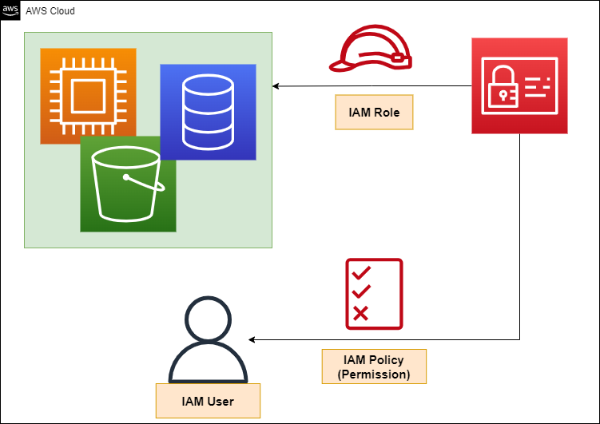
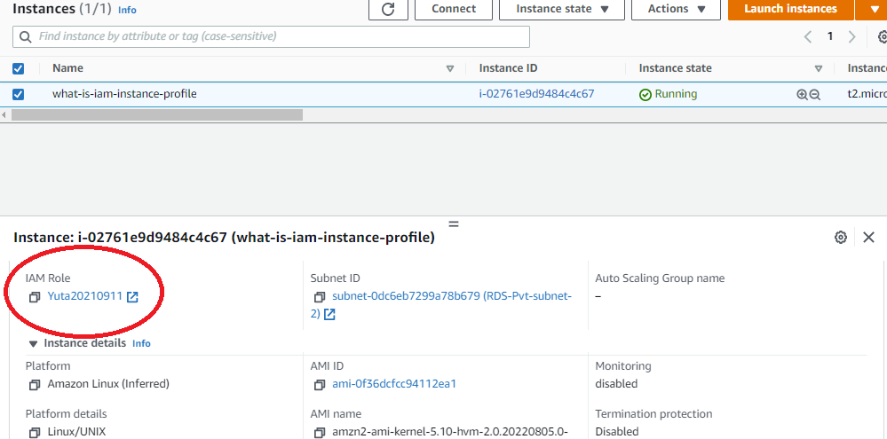
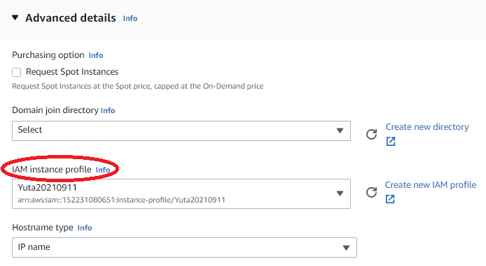

## Introduction

You attach IAM role with IAM policy to AWS resources which granted to operate the other AWS Resources.



However, EC2 is not attached to IAM role, but is attached to IAM Instance Profile.





In AWS CLI, There is the parameter about `IamInstanceProfile`, too.

```console
 aws ec2 describe-instances --query "Reservations[].Instances[].IamInstanceProfile.Arn"
[
    "arn:aws:iam::XXXXXXXXXXXX:instance-profile/Yuta20210911"
]
```

So, what is the IAM Instance Profile?

## About IAM Instance Profile

https://docs.aws.amazon.com/AWSEC2/latest/UserGuide/iam-roles-for-amazon-ec2.html

I found the following description in the AWS documentation.

> Amazon EC2 uses an instance profile as a container for an IAM role. When you create an IAM role using the IAM console, the console creates an instance profile automatically and gives it the same name as the role to which it corresponds. If you use the Amazon EC2 console to launch an instance with an IAM role or to attach an IAM role to an instance, you choose the role based on a list of instance profile names.

Instance profile is the container stored the IAM role and described as attaching that container to EC2 in the document. It is the concept used only in EC2, and when you create IAM role, is created same name automatically. You don't have to be aware of the difference between IAM Instance profile and IAM role. At the important point, it is the case of Infrastructure as Code(IaC)

## Points to note when developing IaC
