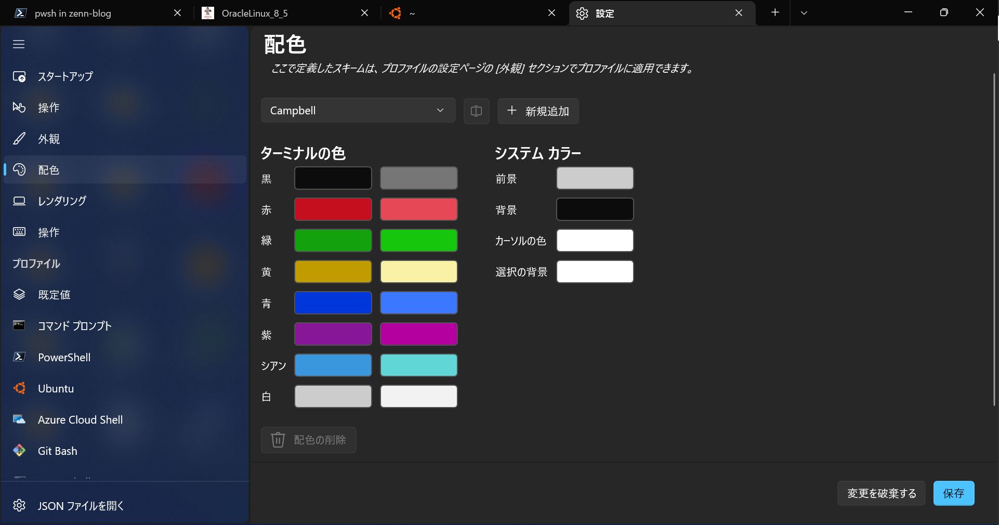
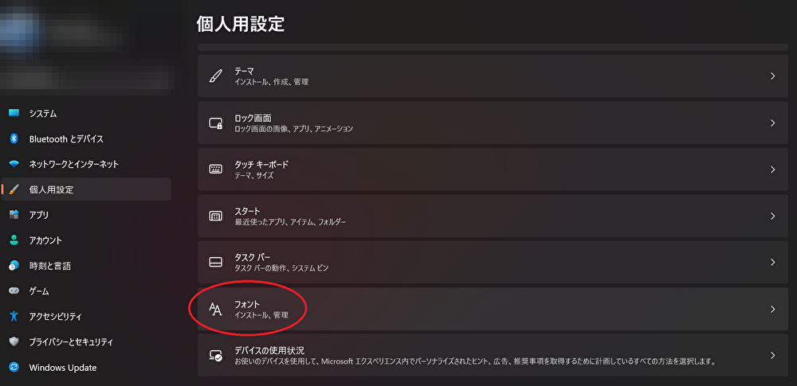
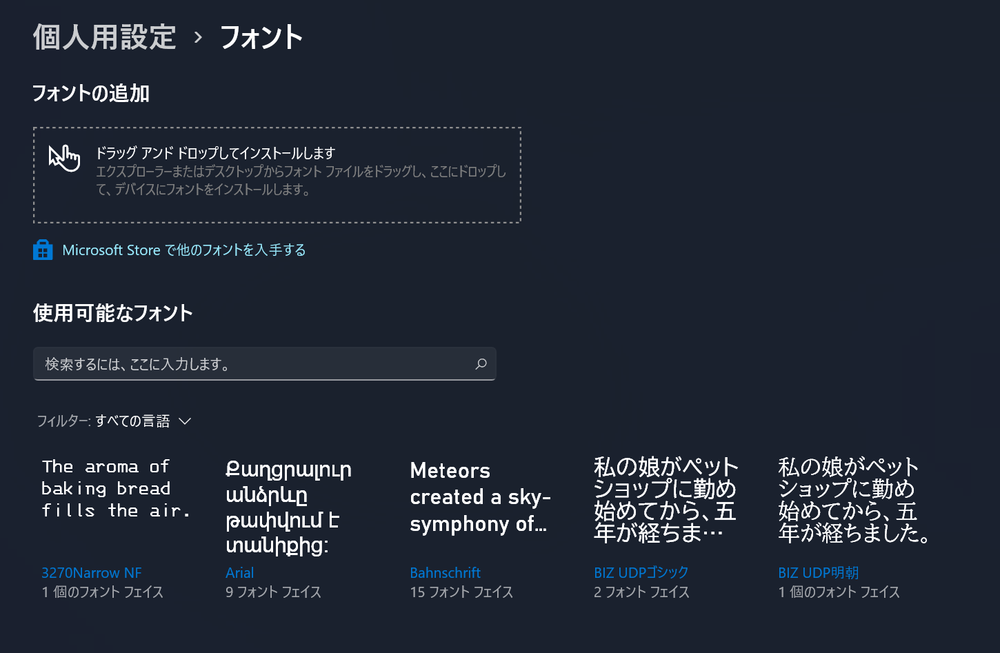
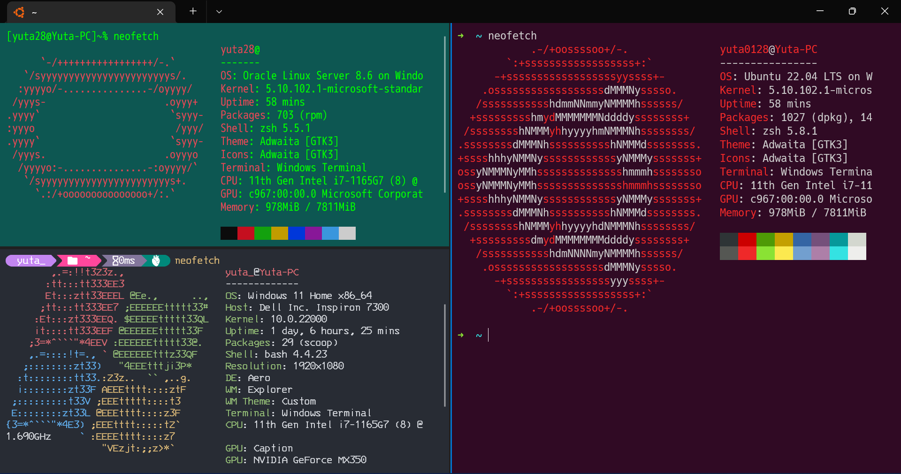
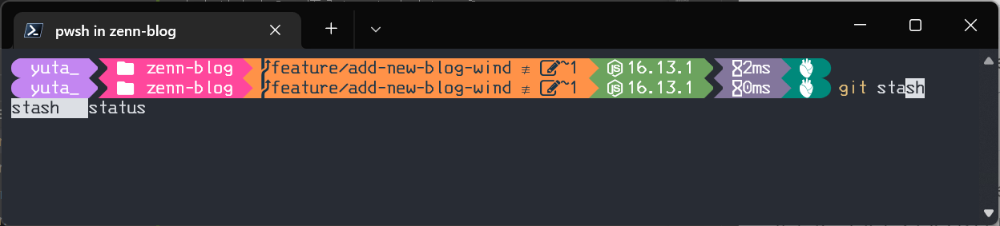
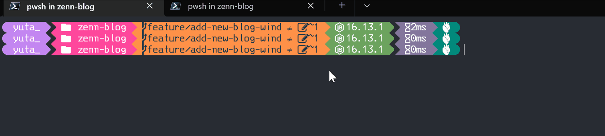
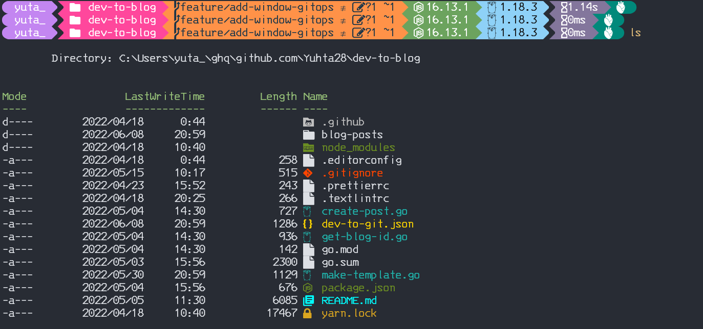

## Introduction

Windows Terminal is a powerful tool for managing your development environment. The settings as they are are sufficient, but you can customize your own settings for more convenient operation.  
So, I will introduce my terminal settings.

## Requirements

In advance, you need to install the following software:

- PowerShell 7.x
- Git for Windows
- WSL2
- Scoop

If you don't have these software, you can install them by following the link below.

### PowerShell 7.x

https://github.com/PowerShell/PowerShell/releases/download/v7.2.4/PowerShell-7.2.4-win-x64.msi

### Git for Windows

https://github.com/git-for-windows/git/releases/download/v2.36.1.windows.1/Git-2.36.1-64-bit.exe

### WSL2

https://docs.microsoft.com/en-us/windows/wsl/install

### Scoop

https://scoop.sh/

## Windows Terminal Settings

The default background color of Windows Terminal is black, making it difficult to tell which terminal is which when you install some WSL distribution or PowerShell. You change the color of the terminal and the font of the text.   
I define my own color and font in the following way.

- color scheme:

  - One Half Dark

- font style:
  - Nerd Font

Nerd Font has a wide selection of development-oriented icons that are useful.  
https://www.nerdfonts.com/#home

### Installation Page

https://eng.fontke.com/font/24644369/

In my opinion, it is a little difficult to install the font in Windows by [official page](https://support.microsoft.com/en-us/office/add-a-font-b7c5f17c-4426-4b53-967f-455339c564c1). You can install the one to drag and drop by Windows personal settings page.  

Set color scheme via GUI or describe it in JSON file.

```json
{
  "background": "#282C34",
  "black": "#282C34",
  "blue": "#61AFEF",
  "brightBlack": "#5A6374",
  "brightBlue": "#61AFEF",
  "brightCyan": "#56B6C2",
  "brightGreen": "#98C379",
  "brightPurple": "#C678DD",
  "brightRed": "#E06C75",
  "brightWhite": "#DCDFE4",
  "brightYellow": "#E5C07B",
  "cursorColor": "#FFFFFF",
  "cyan": "#56B6C2",
  "foreground": "#DCDFE4",
  "green": "#98C379",
  "name": "One Half Dark",
  "purple": "#C678DD",
  "red": "#E06C75",
  "selectionBackground": "#FFFFFF",
  "white": "#DCDFE4",
  "yellow": "#E5C07B"
}
```

Also, you generate it by this generator site.  
https://windowsterminalthemes.dev/

Copy color scheme setting and paste it to the `setting.json` file, making the terminal so nice. 

## Git Customization

Next, I will customize the git operation. I think you make good use of the prompt display and tab completion functions to make the prompt easier to read when you use Git in the terminal. For example, you would describe `.bashrc` or `.zshrc` if you are using Mac.  
There are several useful tools in PowerShell to help your Git Operation, and I will introduce them.

### oh-my-posh

https://ohmyposh.dev/

Oh My Posh is a custom prompt engine for any shell(bash, zsh or PowerShell) that has the ability to adjust the prompt string with a function or variable.

```powershell
scoop install oh-my-posh
```

#### jandedobbeleer(My favorite theme)



After installing it, you describe `oh-my-posh` command loading the oh-my-posh theme at terminal startup in `$PROFILE`.

```powershell
# $PROFILE
oh-my-posh init pwsh --config ~/AppData/Local/Programs/oh-my-posh/themes/jandedobbeleer.omp.json | Invoke-Expression
```

There are various the oh-my-posh themes. You could find favorite theme.  
https://ohmyposh.dev/docs/themes

### posh-git

https://github.com/dahlbyk/posh-git#overview

posh-git is a PowerShell module that integrates Git and PowerShell by providing Git status summary information that can be displayed in the PowerShell prompt.

```powershell
scoop install posh-git
```

After installing it, you add module to `$PROFILE`.

```powershell
# $PROFILE
Import-Module posh-git
```

However, PowerShell's tab completion is a bit quirky by default, as it does not list search suggestions like zsh. Add the following PowerShell command to `$PROFILE` to allow multiple search suggestions to be displayed during tab completion.

```powershell
Set-PSReadLineKeyHandler -Key Tab -Function MenuComplete
```



## Scoop tab completion

In default, Scoop does not have tab completion. You install the module providing the tab completion and activate it.  
https://github.com/Moeologist/scoop-completion

```powershell
scoop install scoop-completion

# add $PROFILE
Import-Module "$($(Get-Item $(Get-Command scoop.ps1).Path).Directory.Parent.FullName)\modules\scoop-completion"
```

## Display icons from terminal

https://github.com/devblackops/Terminal-Icons

This is a PowerShell module to show file and folder icons in the terminal. It is similar to `Material Icon Theme`, VS code plugin.  
https://marketplace.visualstudio.com/items?itemName=PKief.material-icon-theme

Install and activate it in the same way.

```powershell
scoop install terminal-icons

# add $PROFILE
Import-Module Terminal-Icons
```



## Install GitHub CLI

https://cli.github.com/

After git pushing on the terminal, I usually think it is boring to open a browser and PR every time to merge into the GitHub repository. GitHub CLI provides a command line interface to GitHub. On the terminal, you can use it to push, pull and so on.

```powershell
scoop install gh
gh --version
gh version 2.11.3 (2022-05-25)
https://github.com/cli/cli/releases/tag/v2.11.3

# need to authenticate from the terminal using it for the first time.
gh auth login
# pass ssh key or token to link terminal and GitHub together.

gh auth status
github.com
  ✓ Logged in to github.com as Yuhta28 (C:\Users\yuta_\AppData\Roaming\GitHub CLI\hosts.yml)
  ✓ Git operations for github.com configured to use ssh protocol.
  ✓ Token: *******************
```

You merge the PR by using the GitHub CLI, and main branch of local repository automatically is merged and pulled. Merged branches can be deleted, eliminating the accumulation of unneeded branches and reducing the operational load.

```powershell
gh pr merge
? What merge method would you like to use? Create a merge commit
? Delete the branch locally and on GitHub? Yes
? What's next? Submit
✓ Merged pull request #139 (feature/add new blog windows git)
remote: Enumerating objects: 1, done.
remote: Counting objects: 100% (1/1), done.
remote: Total 1 (delta 0), reused 0 (delta 0), pack-reused 0
Unpacking objects: 100% (1/1), 648 bytes | 49.00 KiB/s, done.
From github.com:Yuhta28/zenn-blog
 * branch            main       -> FETCH_HEAD
   32be209..d7672f3  main       -> origin/main
Updating 32be209..d7672f3
Fast-forward
 .textlintrc                           |   3 +-
 articles/94744fc7a339cd.md            |   2 +-
 articles/eventbridge-slack.md         |   2 +-
 articles/first-article-by-cli-yuta.md |   2 +-
 articles/windows-git-dev.md           | 193 ++++++++++++++++++++++++++++++++++

✓ Deleted branch feature/add-new-blog-windows-git and switched to branch main
```

GitHub CLI also provides tab completion tools, and you activate it.

```powershell
# add $PROFILE
Invoke-Expression -Command $(gh completion -s powershell | Out-String)
```

## Conclusion

I share customization that makes Windows Terminal more convenient to use. I believe the change of color theme or implementation of functions such as tab completion and GitHub CLI will contribute to improve development efficiency.  
If you have any other recommendations for Windows Terminal, please comment.

## Original

https://zenn.dev/yuta28/articles/windows-git-dev
